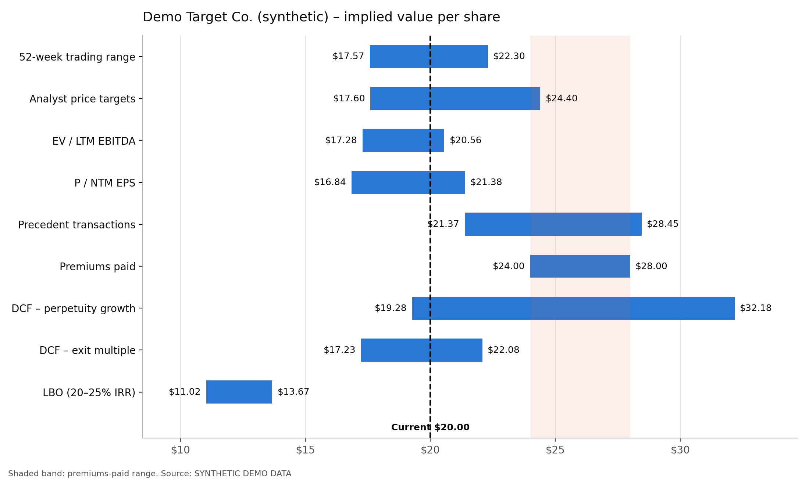

# Sell-Side Valuation & Pitchbook Engine

**Author:** Alessandro Radice · M.Sc. Economics and Business Law (Finance), Università Cattolica del Sacro Cuore, Milan

**One ticker in → a banker-style valuation package out.**
An automated M&A valuation pipeline in Python that produces an auditable **Excel model with live formulas** and a **12-slide PowerPoint pitchbook** for any US-listed company.



---

## Objective

In investment banking, the first valuation of a potential M&A target takes an analyst days: pulling financials, building comps, setting up the WACC, running a DCF, checking what a private equity buyer could pay, and putting it all into a pitchbook.

This project has three goals:

1. **Automate the analyst workflow end to end.** Replicate the valuation section of a sell-side pitchbook (trading comps, precedents, DCF, LBO, football field, buyer universe) from a single configuration cell.
2. **Keep the output in banker format.** Deliver what a Managing Director would actually review: an Excel model anyone can audit and change, and a PowerPoint deck in standard pitchbook layout. A Jupyter notebook alone is not enough.
3. **Show the judgment behind the numbers.** Each methodology is documented, cross-checked between Python and Excel, and its limitations stated openly.

The question it answers is the one behind every sell-side mandate: **what is this company worth to a buyer, and who could pay for it?**

---

## What it does

| Step | Module | What it produces |
|---|---|---|
| 1 | **Market data** | Share price, capital structure, LTM financials and 4–5 years of history from Yahoo Finance, standardized in $ millions |
| 2 | **Trading comparables** | EV/Revenue, EV/EBITDA, P/E (LTM and NTM) for the peer set; mean, median and quartiles; implied share price from the 25th–75th percentile |
| 3 | **Precedent transactions & premiums paid** | Implied control value from precedent EV/EBITDA multiples you provide, plus a 20–40% takeover premium on the unaffected price |
| 4 | **WACC** | Regression betas (2y weekly, 5y monthly), Blume adjustment, peer betas unlevered and relevered (Hamada), cost of debt from an interest-coverage synthetic rating (Damodaran method) |
| 5 | **DCF** | Driver-based 5-year projections (growth, margins, D&A, capex, working capital), unlevered free cash flow, mid-year discounting, perpetuity-growth and exit-multiple terminal values, WACC × growth and WACC × multiple sensitivity tables |
| 6 | **LBO "ability to pay"** | The maximum price a financial sponsor can pay at a 20% IRR, solved numerically, with full debt schedule, cash sweep and IRR × leverage sensitivity |
| 7 | **Football field** | All methodologies on one chart against the current share price, and a preliminary valuation reference range |
| 8 | **Buyer universe** | Strategic acquirers screened on size, pro forma leverage with 100% debt funding, and EPS accretion/dilution in an all-stock deal |
| 9 | **Exports** | Excel model with live formulas and a PowerPoint pitchbook, downloaded automatically |

### The pitchbook (12 slides)
Cover · Executive summary · Company overview · Trading comparables · Precedent transactions & premiums paid · WACC · DCF · DCF sensitivity · LBO ability to pay · Valuation summary (football field) · Potential strategic acquirers · Methodology & assumptions

All tables and the historical financials chart are native PowerPoint objects, so they can be edited directly.

### The Excel model (8 sheets)
`Cover` · `Inputs` · `Comps` · `WACC` · `DCF` · `LBO` · `Football Field` · `Buyers`

- Banker colour code: **blue** = hard-coded input, **black** = formula, **green** = link to another sheet.
- Change any input (share price, growth, margin, terminal growth, leverage, offer price…) and comps statistics, WACC, DCF, sensitivity tables, LBO and football field all recalculate.
- The LBO sheet is set up for Goal Seek: change the offer price and read the IRR.

---

## What you need

| Requirement | Details |
|---|---|
| **Environment** | A Google account to run the notebook in [Google Colab](https://colab.research.google.com), free tier is enough. It also runs in any local Jupyter with Python 3.10+. |
| **Python libraries** | `pandas`, `numpy`, `matplotlib`, `yfinance`, `xlsxwriter`, `python-pptx`. The first cell installs the missing ones automatically. |
| **Data** | Yahoo Finance via `yfinance`. **No API key and no paid subscription needed.** |
| **Optional data** | Precedent transactions (from SEC EDGAR merger proxies such as DEFM14A, press releases, or Capital IQ / Refinitiv if you have access). Updated equity risk premium and default spreads from [Damodaran Online](https://pages.stern.nyu.edu/~adamodar/). |
| **To open the outputs** | Microsoft Excel or Google Sheets for the model, PowerPoint / Google Slides / Keynote for the deck. |
| **Background knowledge** | Accounting (three statements), enterprise vs equity value, DCF and LBO basics. The notebook explains each step. |

---

## How to run it

1. Open `Pitchbook_Engine.ipynb` in Google Colab (`File → Upload notebook`).
2. In the **Configuration** cell, set:
   ```python
   TARGET = "CAG"                                          # company to value
   PEERS  = ["GIS", "CPB", "SJM", "HRL", "KHC", "MKC", "POST"]   # trading comparables
   BUYERS = ["MDLZ", "PEP", "GIS", "HSY", "KHC"]           # potential acquirers
   ```
3. Adjust the assumptions in the `A` dictionary if you want. Any assumption left as `None` is derived from the data.
4. `Runtime → Run all`. Runtime is about 1 minute.
5. The Excel model, the pitchbook and the football field chart download automatically.

**Offline mode:** set `DATA_MODE = "demo"` to run on a synthetic company universe without internet access. Every slide is then labelled *SYNTHETIC DEMO DATA*. The notebook also switches to demo mode automatically if Yahoo Finance is unreachable, so check for that label.

### Key assumptions you can change

| Assumption | Default | Meaning |
|---|---|---|
| `terminal_growth` | 2.5% | Perpetuity growth rate in the DCF |
| `exit_multiple` | peer median | EV/EBITDA at exit for the DCF and LBO |
| `revenue_growth` | fade from 3y CAGR to terminal growth | List of 5 yearly growth rates |
| `ebitda_margin`, `da_pct_rev`, `capex_pct_rev` | 3-year historical average | Operating drivers |
| `erp` | 4.5% | Equity risk premium |
| `premium_range` | 20%–40% | Takeover premium range |
| `lbo_leverage`, `lbo_interest`, `lbo_target_irr` | 5.0x, 8.5%, 20% | Sponsor financing and return hurdle |
| `buyer_max_leverage` | 4.0x | Leverage ceiling for an all-cash strategic deal |

---

## Methodology & validation

- **Comps:** multiples above 100x or with negative denominators are excluded, following standard practice.
- **DCF:** unlevered FCF = EBIT × (1 − t) + D&A − capex − ΔNWC; mid-year convention; terminal value discounted from the end of year 5. Each method shows the implied cross-check (implied exit multiple from the perpetuity method, implied growth from the exit method).
- **LBO:** debt = leverage × LTM EBITDA, interest on opening balance, 100% cash sweep, exit at the peer median multiple after 5 years. The maximum entry price is solved by bisection.
- **Reconciliation:** DCF value per share and LBO IRR are computed independently in Python and in the Excel formulas, and they match to the cent. The Excel model recalculates with zero formula errors.

## Limitations

- Yahoo Finance data is not reconciled to SEC filings. Check debt, share count and EBITDA against the latest 10-K/10-Q before relying on the output.
- Basic share count only: no treasury-stock method for options and RSUs.
- No stub-period adjustment: the first projection year is treated as a full year from the valuation date.
- Synthetic-rating spreads and the equity risk premium are approximations and should be refreshed from Damodaran each year.
- The buyer screen is quantitative only; strategic fit and antitrust risk need qualitative review.

This project is for educational purposes and is not investment advice.

---

## Repository structure

```
├── Pitchbook_Engine.ipynb              # the notebook (run this)
├── pitchbook_engine.py                 # same code as a plain Python script
├── TGT_DEMO_valuation_model.xlsx       # sample Excel model (synthetic data)
├── TGT_DEMO_pitchbook.pptx             # sample pitchbook (synthetic data)
├── Pitchbook_Engine_Deck.pdf           # project presentation
├── football_field.png                  # sample chart
└── README.md
```

## Roadmap

- Precedent transactions scraped automatically from SEC EDGAR merger proxies
- Treasury-stock method for fully diluted shares
- Monte Carlo DCF with a probability distribution of value per share

## Stack

`Python` · `pandas` · `numpy` · `yfinance` · `matplotlib` · `xlsxwriter` · `python-pptx` · Google Colab
